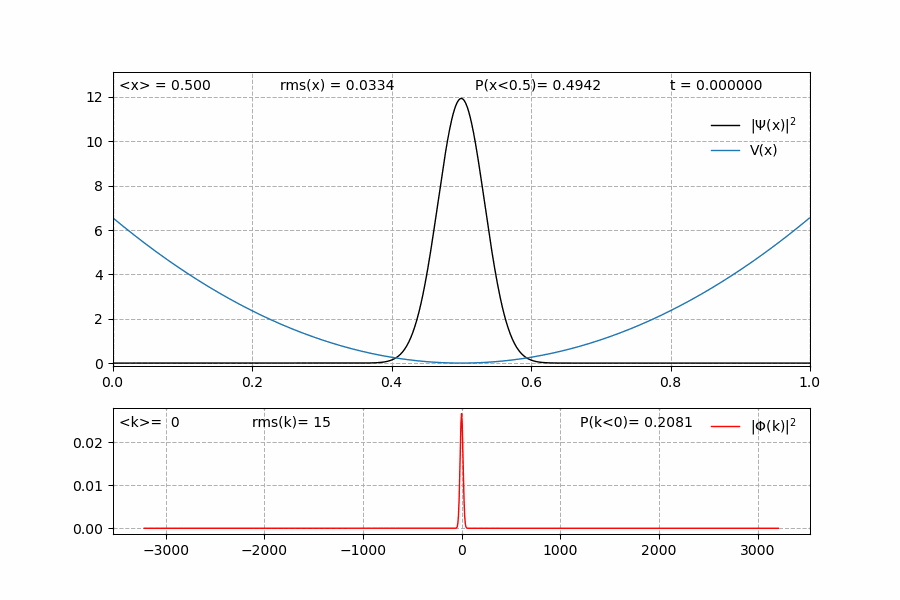

# Quantum harmonic oscillator ground state

In the harmonic oscillator the potential is in the form $V(x) = \frac{1}{2}k x^2$. 
It can be proven that in the ground state the probability density of the oscillator is shaped like a gaussian, and the standard deviation is $\sigma = \frac{1}{\sqrt 2 \omega}$ (in atomic units).
Therefore, if we choose our **sigma** parameter to be equal to $\frac{1}{\sqrt{ 2 \sqrt{2 a}}}$, where $a$ is the aperture of the parabola, we should obtain a state which is time-independent, i.e. the ground eigenstate.

## Input parameters _(params.py)_

```python
#----------------------
# simulation parameters

t = 0.005  # simulation time

#----------------------
# gaussian parameters

sigma = 0.0334370152488211 # std
x_0 = 0.5   # starting position 
k_0 = 0   # initial momentum

# boundary conditions

boundary = 'periodic'   # 'periodic'

#-----------------------
# potential parameters

potential = 'harmonic'   # 'flat', 'barrier', 'harmonic', 'delta'

# harmonic potential 

a = 1e5   # aperture

# ----------------------
# plotting parameters

# file format
file_format = 'gif'  # 'gif', 'mp4'

# animation speed multiplier

play_speed = 100 # video duration (seconds) = t * 2e5 / speed
```

## Animation




```python

```
