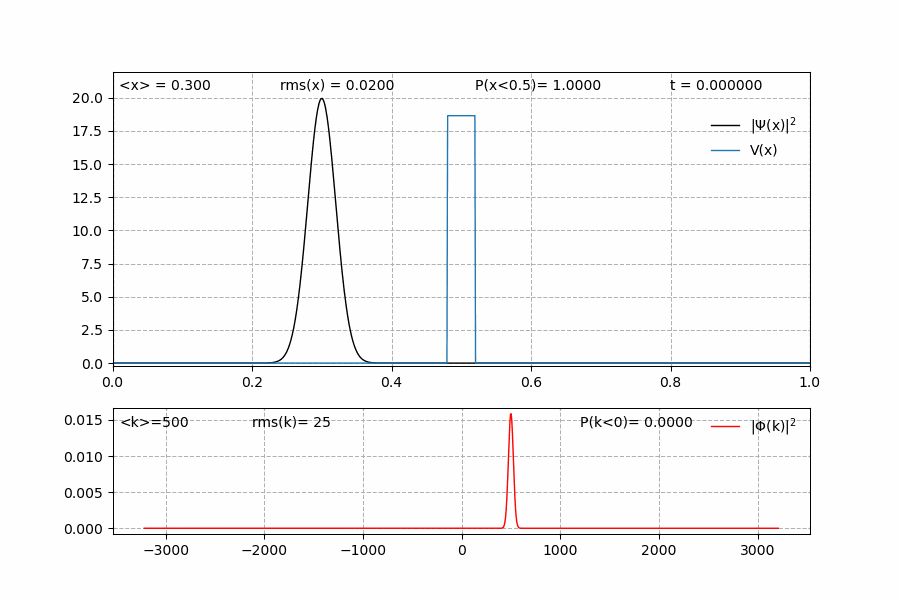

# Quantum tunneling

A wave-packet with initial momentum $k_0 = 500$ has a kinetic energy equal to $E = 2.5 \times 10^{5}$.
Due to the energy distribution, it can still overcome a barrier having energy $V = 3 \times 10^{5}$.

## Input parameters _(params.py)_

```python
#----------------------
# simulation parameters

t = 0.001  # simulation time

#----------------------
# gaussian parameters

sigma = 0.02 # std
x_0 = 0.3    # starting position 
k_0 = 500   # initial momentum

# boundary conditions

boundary = 'periodic'   # 'periodic'

#-----------------------
# potential parameters

potential = 'barrier'   # 'flat', 'barrier', 'harmonic', 'delta'

# potential barrier / well

b = 0.02 # half width 
h = 1.3e5  # height: h < 0 = potential well

# ----------------------
# plotting parameters

# file format
file_format = 'gif'  # 'gif', 'mp4'

# animation speed multiplier

play_speed = 50 # video duration (seconds) = t * 2e5 / speed
```

## Animation




```python

```
